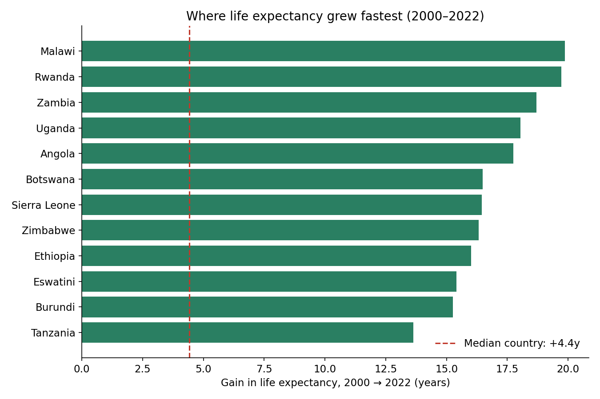
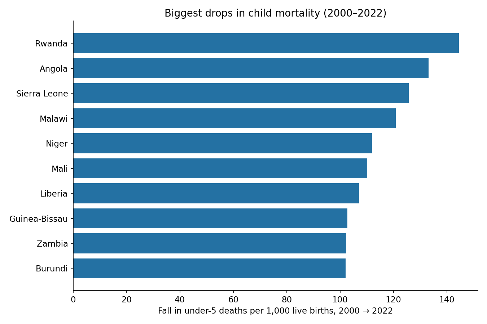
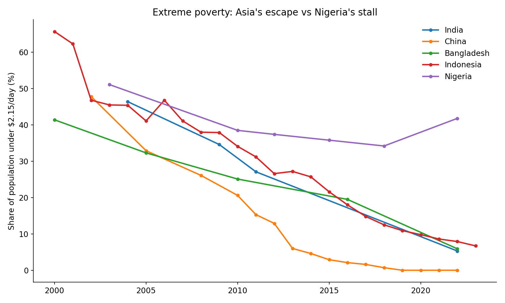
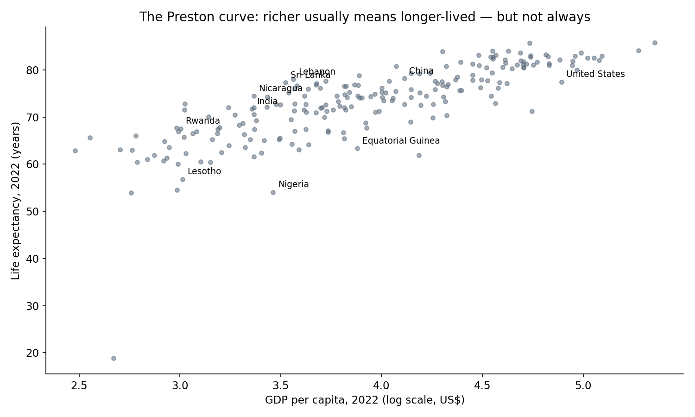

# World Development Indicators (2000–2023)

How the world got healthier and richer over two decades — told through World Bank data
on life expectancy, child mortality, extreme poverty, and the link between wealth and health.

## Key findings

**Africa's health turnaround.** Malawi (+19.9 years) and Rwanda (+19.7 years) gained roughly
two decades of life expectancy between 2000 and 2022. The median country gained just 4.4 years.



**Child mortality collapsed where it was worst.** Rwanda cut under-5 deaths by 144.5 per
1,000 live births; Angola, Sierra Leone, and Malawi each cut 120+. The median country cut 14.8.



**Asia escaped extreme poverty; Nigeria stalled.** The share of people living under
$2.15/day fell from 46.4% to 5.3% in India, 47.8% to ~0% in China, and 65.7% to 6.7% in
Indonesia. Nigeria barely moved (51.1% → 41.8%).



**The Preston curve holds — with striking exceptions.** Log GDP per capita vs life
expectancy correlates at r = 0.79 across 212 countries (2022). But Sri Lanka, Lebanon, and
Nicaragua live far longer than their income predicts, while Nigeria, Equatorial Guinea, and
Lesotho live far shorter. Oil wealth doesn't buy health on its own.



**India, 2000 → 2023:** life expectancy 62.7 → 72.0 years, GDP per capita $443 → $2,434,
under-5 mortality 91.8 → 28.0, extreme poverty 46.4% → 5.3%, literacy 61% → 82%.

## Data

Pulled live from the [World Bank API](https://datahelpdesk.worldbank.org/knowledgebase/articles/889392)
(no key required) — 219 countries, 2000–2023, 6 indicators:

| Indicator | World Bank code |
|---|---|
| Life expectancy at birth (years) | SP.DYN.LE00.IN |
| GDP per capita (current US$) | NY.GDP.PCAP.CD |
| Under-5 mortality (per 1,000 live births) | SH.DYN.MORT |
| Adult literacy rate (% of ages 15+) | SE.ADT.LITR.ZS |
| Population, total | SP.POP.TOTL |
| Poverty headcount at $2.15/day (%) | SI.POV.DDAY |

Caveats: literacy and poverty have sparse country coverage (survey-based), so they're
secondary to the near-complete life expectancy, GDP, mortality, and population series.
CO₂ indicators were retired from the API and excluded rather than estimated.

## Repository structure

```
├── data/
│   ├── wdi_merged.csv        # tidy table: iso3, country, year + 6 indicators
│   └── wdi_<indicator>.csv   # per-indicator extracts
├── images/                   # the four headline charts
├── python/
│   ├── fetch_wdi.py          # reproduces the dataset from the World Bank API
│   ├── eda.py                # exploratory analysis behind the findings
│   └── make_charts.py        # regenerates every chart in images/
└── README.md
```

## What's next

- SQL query pack (top gainers/losers, correlations, outlier detection)
- Power BI dashboard: overview map, health turnaround, poverty divergence, Preston curve

## Tech

Python (pandas, matplotlib) · SQL · Power BI (DAX)
